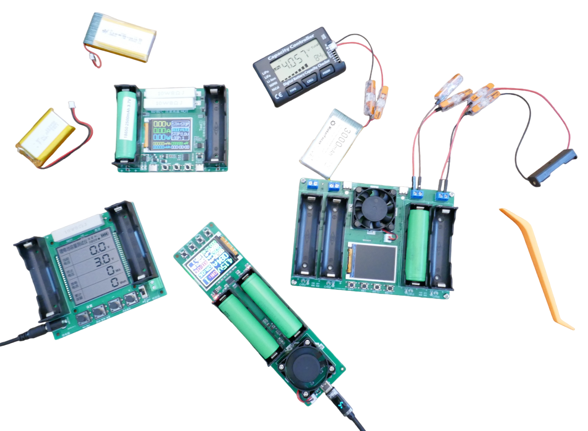

# All-In-One Battery Testers

> Affordable Yet Effective All-In-One Testers For Capacity Tests And Measuring Internal Resistance

Surprisingly affordable *all-in-one* testers offer all the necessary measurements to reliably distinguish *counterfeit* batteries from *genuine* ones and provide a general estimate of battery health. These testers are not only accurate but also versatile, making them ideal tools for both casual and more technical battery testing.

With a variety of models available, this section explores their capabilities and key differences, helping you find the right fit for your testing needs.

## Overview

Most test devices provide the following core features:

* **Discharge Test:** Discharges a battery to a predefined (configurable) stop-voltage and logs the *mAh* (milliampere-hour) and *mW* (milliwatt-hour) capacity, making it easy to see how much usable energy a battery can deliver. While most batteries specify their total capacity in *mAh*, the true *energy capacity* is more accurately expressed in *mWh*, as this unit accounts for the voltage drop that occurs during discharge and is helpful when comparing different batteries.
* **Charging and Test:** Fully charges a battery while logging the *mAh* and *mW* transferred to the battery. Charging is typically limited to *LiIon/LiPo* battery types due to the charger ICs used; *LiFePO₄* and other battery chemistries cannot be charged. 
* **Auto-Testing:** Performs a complete test cycle, starting with fully charging the battery, then discharging it to determine capacity, and finally recharging it to prepare for use.
* **Internal Resistance:** Measures the battery's *internal resistance* using a straightforward "multimeter method" (*DC Test*). Although this is not as precise as lab-grade methods, it’s useful for a quick estimate of battery health.
* **External Connectors:** While many devices are tailored for specific battery types (e.g., *18650* cells) and include compatible holders, most also feature screw terminals or other connectors to support various battery types. This flexibility allows for testing multiple battery formats without additional equipment.

> [!IMPORTANT]
> Most testers are limited to **5V battery input**, which is suitable for single-cell *LiIon*, *LiPo*, and *LiFePO₄* cells, as well as *AA*/*AAA* cells. However, they are incompatible with multi-cell batteries (e.g., *12V LiFePO₄* or *7.4/11.2V LiPo packs*). Connecting batteries with voltage above 5V will damage these devices.  

### Additional Tips for Using Battery Testers
* **For Accurate Readings**: Ensure the battery is correctly inserted, and allow a brief warm-up period for the tester.
* **Testing Different Battery Chemistries**: Stick to the chemistries specified for the device to avoid inaccurate readings or potential damage. Lithium-based chemistries (LiIon, LiPo, LiFePO₄) tend to work best with these testers.
* **Interpreting Results**: High internal resistance or low capacity often indicates a battery near the end of its lifespan. Frequent full charge-discharge cycles may reduce battery life for certain chemistries.

With these features and tips, you can make the most of your battery tester to gauge battery performance, identify counterfeit units, and extend the lifespan of quality batteries.

### Differences

The test devices differ in the following aspects:

* **Portability:** Some testers reserve one battery bay solely for powering the measurement circuitry, making these devices independent from external USB power. When battery-powered, these testers can only perform **discharge** tests, as the supply battery doesn’t provide sufficient power to charge the battery under test. The downside is that one battery holder is unavailable for testing, even if the device is powered externally.
* **Multiple Batteries:** While some testers evaluate only *one* battery at a time, others can test *multiple* batteries simultaneously. This feature is crucial for testing larger numbers of batteries, as a complete discharge test can take several hours.
* **Discharge Current:** All testers use simple *load resistors*, so they cannot maintain a constant discharge current or allow adjustments. The discharge current is solely determined by the value of the load resistor and the gradual voltage drop as the battery discharges. Some testers have a maximum discharge current of *1A*, while others limit it to *500mA*, depending on the resistor used.
* **Charge Current:** Testers with charging capabilities rely on standard **LiIon/LiPo charging ICs** and are limited to charging these specific chemistries. The maximum charging current is generally capped at **1A**, which is suitable for average *18650 cells* but may be too high for smaller *LiPo batteries*. 
* **Fan Cooling:** The *load resistor* dissipates energy as heat, and without cooling, it can become extremely hot. Some devices incorporate fans to help dissipate heat, protecting components and ensuring more stable readings.
* **Missing Features:** Certain devices have limited functionality, offering only discharge tests without charging capabilities. This limits their use, as they cannot perform *automated tests* where a battery is first fully charged before testing. Others only measure *current state of charge*, providing no discharge load or capacity testing.

### Simple Improvements

Many devices can be enhanced with small upgrades:

* **Additional Battery Types:** By connecting additional battery holders to the screw terminals or solder pads, you can test various battery form factors beyond the device’s default configuration.

    

* **Heat Sink:** Adding a simple *heat sink* to the load resistors improves heat dissipation and reduces the risk of accidental burns. Without a heat sink or fan, these resistors can reach temperatures around *80°C*; a heat sink can lower this to *60°C*, and the vertical fins reduce the exposed hot surface.

    

> Tags: Battery Tester, All-in-One, Capacity, Internal Resistance

[Visit Page on Website](https://done.land/components/power/battery/batterytesters/all-in-onetesters?264218101229240252) - created 2024-10-28 - last edited 2024-10-28
